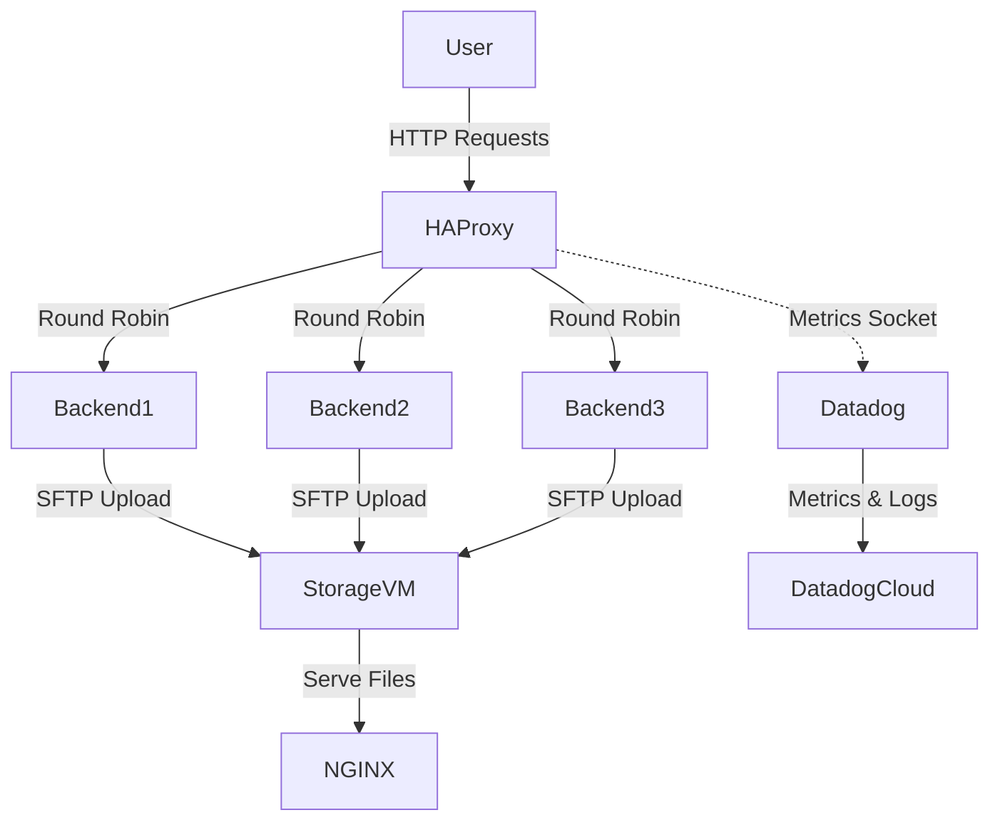
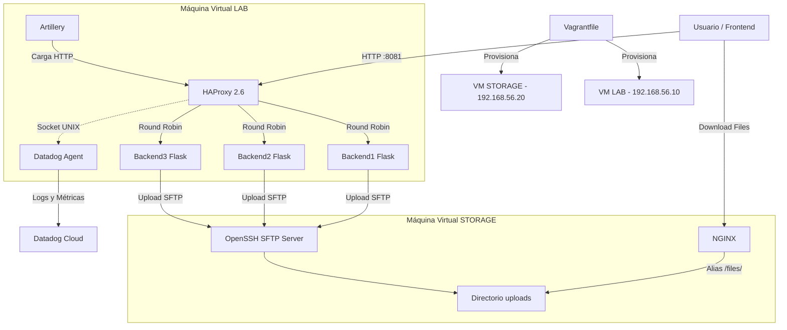

# Proyecto 8 - HAProxy + Datadog
--------------------------------------------------------------------

## Arquitectura del Clúster
El siguiente diagrama muestra cómo interactúan los componentes dentro de la máquina virtual (Vagrant):




--------------------------------------------------------------------
# Ejecución

Para iniciar el entorno, Vagrant descargara y preparara una máquina Linux con Docker instalado.

```bash
git clone https://github.com/Katar012/proyecto8-haproxy-datadog/
cd proyecto8-haproxy-datadog
vagrant up
vagrant provision storage
vagrant ssh lab
cd /vagrant
docker-compose up --build -d

## TROUBLESHOOTING

EN CASO TAL DE ERRORES POR ESTADO CORRUPTO:

docker-compose down -v --remove-orphans
docker-compose build --no-cache
docker-compose up -d

SI LAS METRICAS DE CPU Y RAM NO SE MUESTRAN:

docker-compose restart datadog

SI TODAVIA NO SE MUESTRAN:

exit
vagrant destroy -f

y volver a ejecutar desde vagrant up 

```
## Primera Parte: Cluster HAProxy con backends

1. El estado de los backends se puede verificar desde el host en la [pagina de estadisticas de haproxy](http://192.168.65.10:8080/stats) o la ip de la maquina http://192.168.65.10:8080/stats.

3. Luego verificamos en otra ventana de la misma maquina virtual "lab" el roundrobin con este comando:
```bash
for i in {1..10}; do curl -s http://localhost:8081/health; echo ""; done
```
Este ciclo verifica roundrobin.

3. Con ```docker-compose logs haproxy``` podemos visualizar registros estructurados.

## Segunda Parte: Integración Datadog y Regiones
NOTA: Datadog tiene multiples regiones (ej: US1, US3, US5, EU). Es importante que la variable `DD_SITE` en el archivo `docker-compose.yml` coincida exactamente con la región de la cuenta donde se sacó la API KEY. Si la api es del sito region por defecto (US1), el site debe ser `datadoghq.com`. Con el correo institucional de la autonoma aveces varia a `us5.datadoghq.com`, es muy importante que DD_SITE apunte al sitio donde se creo la cuenta. ¡POR FAVOR REVISAR docker-compose.yml!

1. Ingresar a [Datadog](https://app.datadoghq.com/).
2. En la barra de busqueda ingresar "API KEYS"
3. En la raíz de este proyecto, abrir el archivo .env
4. Pegar para que quede asi: `DD_API_KEY=tu_clave_aqui` hay un archivo .env.example en la raiz para visualizar como debe ir
5. Recordar: en el archivo docker-compose.yml, abajo de `DD_API_KEY=tu_clave_aqui` esta `DD_SITE=datadoghq.com`, añadir sufijo "usX." acorde a X region de donde sale la llave API

### 1. Creación de Dashboards (Uso de JSON)
Para evitar configurar los gráficos a mano, Datadog permite importar dashboards y widgets usando código JSON.

Hemos exportado el Dashboard completo para que lo puedas clonar con un solo clic. El código se encuentra en el archivo `datadog_exports/dashboard.json`.
1. En Datadog, ve a **Dashboards -> New Dashboard**.
2. Dale al botón de configuración (ruedita) o busca la opción **Import Dashboard JSON**.
3. Pega todo el contenido del archivo `datadog_exports/dashboard.json`.

## Tercera Parte: Generación de tráfico con Artillery
Hemos creado diferentes escenarios de prueba en la carpeta `artillery/` para estresar el cluster y validar nuestras metricas:

- `normal.yml`: Tráfico estándar.
- `spike.yml`: Pico de tráfico repentino.
- `errors400.yml y errors500.yml`: Generan solicitudes que retornan errores HTTP 500 o HTTP 400.
- `latency.yml`: Dispara peticiones al endpoint `/slow` para simular lentitud y ver cómo se eleva la gráfica de latencia promedio.
- `soak.yml`: Prueba de larga duración (5 minutos) para validar estabilidad y consumo de RAM.
- `mixed.yml`: 90% tráfico sano y 10% tráfico con errores (ideal para ver cómo se separan las gráficas de peticiones vs errores).

Se ejecutan con el siguiente comando DESDE LA MAQUINA LAB:
```bash
docker-compose run --rm artillery run latency.yml
```

NOTA: Para ejecutar las pruebas traficoFlask.yml y traficoNginx.yml usaremos el archivo test.txt de la carpeta artillery, crear en caso tal de que no este con el comando: 
```
echo "archivo de prueba" > artillery/test.txt
```

Se cambia obviamente el nombre del archivo por el que se desee usar, en este caso se uso latency.yml.

## Generacion de trafico con sftp
Se creo una maquina virtual adicional que contiene un servicio sftp, la maquina se llama storage.
```
cd proyecto8-haproxy-datadog
vagrant up
vagrant provision storage
vagrant ssh storage
cd /sftp/uploads
```
En la carpeta sftp/uploads/ encontraremos los archivos que se subiran desde los contenedores en el [frontend](http://192.168.65.10:8081) con direccion a http://192.168.65.10:8081/

Desde la maquina lab podemos verificar el acceso al servidor sftp de la maquina storage mediante el siguiente comando, la contraseña es 1234.
```
sftp sftpuser@192.168.65.20
1234
cd uploads
ls
```
La subida de archivos se realiza desde el Flask [frontend](http://192.168.65.10:8081) con direccion a http://192.168.65.10:8081/

Y la descarga de archivos es servida directamente por Nginx desde la maquina storage (En version 4.0.0 hacia adelante)

NOTA: Anteriormente en la version 3.2.0 Flask se encargaba de la carga y descarga de archivos a la vez, demorando mucho en archivos superiores a las 200mb.

## Implementacion de Nginx
Para relegar a flask unicamente a la logica de los backends y la subida de archivos, utilizamos Nginx con la finalidad de aliviar la descarga de archivos, evitando asi tener que ocupar de un timeout mas largo para que flask termine de procesar la solicitud de descarga exitosamente.

Flask queda unicamente encargado de:
- Logica backend
- Subida de archivos via sftp

Nginx hace lo siguiente:
- Maneja descargas http
- Reduce la carga sobre los backends Flask
- Y ademas tenemos un nuevo [endpoint](http://192.168.65.20/files/) en http://192.168.65.20/files/ con tamaños de archivos y timestamps

En caso tal de limpiar el entorno mal (o que el consumo de cpu y ram no aparezcan en el dashboard) se debe reiniciar datadog con el siguiente comando:

```docker-compose restart datadog```
MENCIONADO ARRIBA, PUEDE QUE NO FUNCIONE EN la version 4.0.0

### 2. Creación de Alertas/Monitores
Hemos configurado dos monitores críticos. Para que a tus compañeros se les haga más fácil crearlos, pueden importar la configuración exportada en formato JSON, o crearlos manualmente:

**Opción A (Importar JSON):**
Hemos guardado los JSON listos para importar en la carpeta `datadog_exports`. Simplemente cópialos en Datadog:
1. `datadog_exports/monitor_errores.json`: Te alertará si la tasa de errores HTTP 500 supera el 5%.
2. `datadog_exports/monitor_backend_caido.json`: Te alertará e indicará el nombre exacto de cuál de los servidores se apagó.

**Opción B (Manual paso a paso):**

**Alerta 1: Tasa de Errores > 5%**
1. Ve a **Monitors -> New Monitor -> Metric**.
2. Elige la pestaña **Formula**.
3. Letra `a`: `haproxy.backend.response.5xx{*}`
4. Letra `b`: `haproxy.frontend.requests.rate{*}`
5. Fórmula: `(a / b) * 100`
6. En Set Alert Conditions pon **Above 5** y dale a Guardar.

**Alerta 2: Backend Caído**
1. Ve a **Monitors -> New Monitor -> Metric**.
2. En métrica escribe `docker.cpu.usage`, from `image_name:vagrant_backend*`, avg by `image_name`.
3. Datadog lo detectará como una "Multi Alert".
4. Baja hasta encontrar la opción **"Notify if data is missing"** y pon que avise si no hay datos por más de 1 minuto.
5. Usa `{{image_name.name}}` en el título para saber exactamente cuál de los 3 se apagó.
--------------------------------------------------------------------
# PRUEBAS MINIMAS:

## PRUEBA DATADOG

Mostrar dashboard datadog con metricas de HAProxy en tiempo real (los 60 segundos que tarda datadog en actualizar jajaja)
El dashboard esta adjuntado en la carpeta Datadog_exports, donde se podra encontrar UN DASHBOARD y DOS MONITORES, se debe importar en datadog, recordar que el dashboard no funciona si la api de datadog no esta en el .env

## PRUEBA ARTILLERY:

Realizar una prueba artillery de alta carga y observar el pico de metricas en datadog.
Las pruebas estan en la carpeta artillery, se ejecutan con ```docker-compose run --rm artillery run soak.yml``` desde la maquina lab, tal como se indica anteriormente en este documento.
Luego se comprueban los picos o cambios en las graficas en Datadog.

## PRUEBA DE ALERTAS:

Disparar alertas configuradas en Datadog, por ejemplo, apagar un backend con ```docker-compose stop backend1```, el navegador utilizara una sola conexion tcp entre las que quedan activas, el frontend mostrara un solo nodo activo, pero es importante que ejecutemos en lab ```for i in {1..10}; do curl -s http://localhost:8081/health; echo ""; done``` para verificar que todavia existe un balance entre los backends, ```docker-compose stop backend2``` hara que el frontend use unicamente el nodo backend3.

Para volver a levantarlos se debe hacer ```docker-compose start backend1 backend2``` y luego reiniciamos el contenedor de haproxy con ```docker-compose restart haproxy```
--------------------------------------------------------------------
# Informe
Enlace a informe: [https://docs.google.com/document/d/1LwtuTcqxJYRZ5sKOAE9KDB0WlzXiwcqI/edit?usp=sharing&ouid=106756143487291349925&rtpof=true&sd=true](https://docs.google.com/document/d/14S_Y4-6pQ2XyMcUsTyjnDjbLVXb4C9KO/edit?usp=sharing&ouid=101279883039457215575&rtpof=true&sd=true)

--------------------------------------------------------------------
# Integrantes

### Juan David Cuero Reina.
### Juan Esteban Vila Martin.
### Alejandro Rodriguez.
### Diego Alejandro Ramirez.
