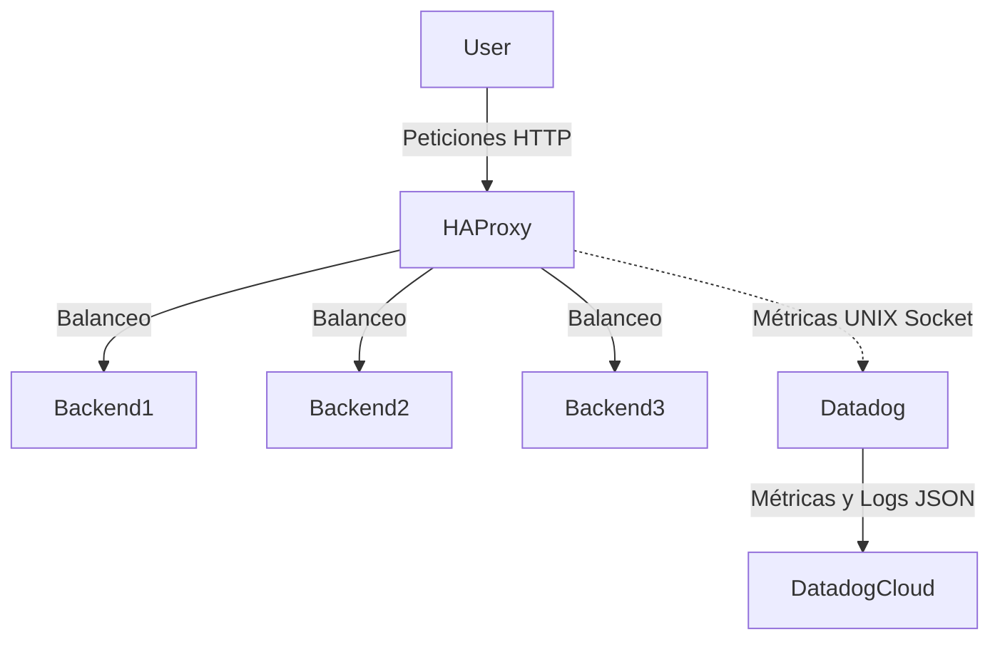

# Proyecto 8 - HAProxy + Datadog
--------------------------------------------------------------------

## Arquitectura del Clúster
El siguiente diagrama muestra cómo interactúan los componentes dentro de la máquina virtual (Vagrant):



--------------------------------------------------------------------
## Configuración de Datadog (API Key)

1. Ingresar a [Datadog](https://app.datadoghq.com/).
2. En la barra de busqueda ingresar "API KEYS"
3. En la raíz de este proyecto, abrir el archivo .env
4. Pegar para que quede asi: `DD_API_KEY=tu_clave_aqui`

--------------------------------------------------------------------
# Ejecución

Para iniciar el entorno, Vagrant descargará y preparará una máquina Linux con Docker instalado.

```bash
git clone https://github.com/Katar012/proyecto8-haproxy-datadog/
cd proyecto8-haproxy-datadog
vagrant up
vagrant ssh lab
cd /vagrant
docker-compose up --build -d
```
### Luego verificamos en otra ventana de la misma maquina virtual "lab"
```bash
for i in {1..10}; do curl -s localhost:8081; done
```
Este ciclo verificara que tenemos un balance entre los 3 backends, una vez todo este preparado ingresar a 

--------------------------------------------------------------------
# Integrantes

### Juan David Cuero Reina.
### Juan Esteban Vila Marin.
### Alejandro Rodriguez.
### Diego Alejandro Ramirez.
