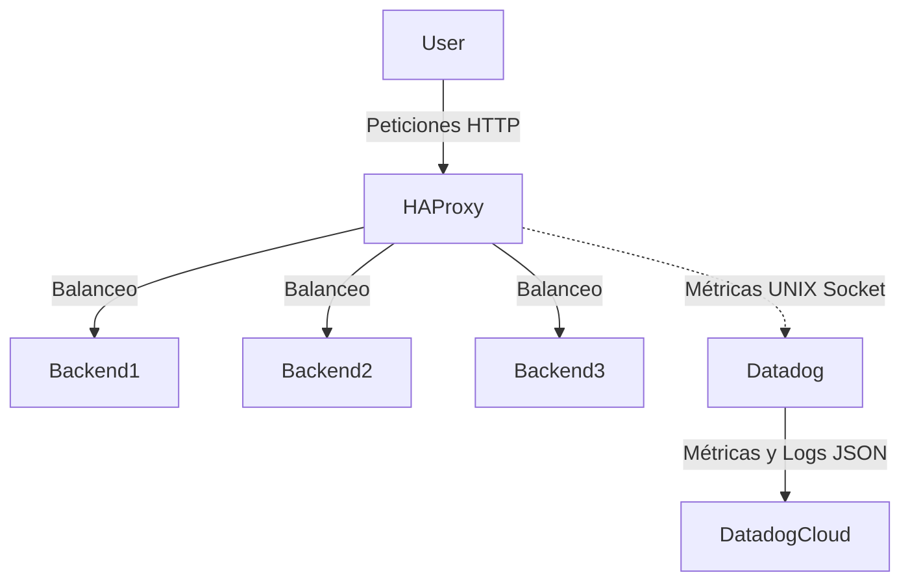

# Proyecto 8 - HAProxy + Datadog
--------------------------------------------------------------------

## Arquitectura del Clúster
El siguiente diagrama muestra cómo interactúan los componentes dentro de la máquina virtual (Vagrant):



--------------------------------------------------------------------
## Configuración de Datadog (API Key) (esto lo haces despues de hacer git clone y entrar a la maquina virtual)

1. Ingresar a [Datadog](https://app.datadoghq.com/).
2. En la barra de busqueda ingresar "API KEYS"
3. En la raíz de este proyecto, abrir el archivo .env
4. Pegar para que quede asi: `DD_API_KEY=tu_clave_aqui`

--------------------------------------------------------------------
# Ejecución

Para iniciar el entorno, Vagrant descargará y preparará una máquina Linux con Docker instalado.

```bash
git clone https://github.com/Katar012/proyecto8-haproxy-datadog/
cd proyecto8-haproxy-datadog
vagrant up
vagrant ssh lab
cd /vagrant
docker-compose up --build -d
```

## Primera Parte: Cluster HAProxy con backends

1. El estado de los backends se puede verificar desde el host en la [pagina de estadisticas de haproxy](http://192.168.65.10:8080) o la ip de la maquina http://192.168.65.10:8080.
Tambien podemos verificar de manera extra en http://192.168.65.10:8081/metrics la respuesta de los backends.

2. Luego verificamos en otra ventana de la misma maquina virtual "lab"
```bash
for i in {1..10}; do curl -s localhost:8081; done
```
Este ciclo verificara que tenemos un balance entre los 3 backends.

3. Con ```docker-compose logs haproxy``` podemos visualizar registros estructurados con la siguiente estructura como ejemplo:
```{"backend":"web_back","server":"backend1","status":200}```

Una vez todo este preparado, ingresar al [Dashboard](https://p.us5.datadoghq.com/sb/85988188-4804-11f1-bc34-5ef128fabc1b-9f9dd79c16fcbd4c9aabbd251896a864).

## Segunda Parte: Integracion Datadog
# (ahora si haces lo del api de datadog y lo pones en el .env)

## Tercera Parte: Generación de tráfico y observabilidad

La generacion de trafico con artillery es muy sencilla, cada archivo de prueba esta guardado y configurado en la carpeta /artillery que se encuentra en la raiz del repositorio.
Para crear una prueba especifica con creamos un archivo cualquiernombre.yml y configuramos dicho archivo con target hacia http://haproxy, las fases (duraciones y numero de clientes (arrivalRate)) pueden ser configuradas a gusto.

1. Anteriormente se ingreso ```docker-compose up --build -d```
2. Detendremos el proceso artillery con ```docker-compose down artillery``` (NOTA PARA COLABORADORES: Esto puede evitarse con una configuracion despues)
3. Luego corremos la prueba con ```docker compose run --rm artillery run cualquiernombre.yml```. Especificando el nombre del archivo yml creado anteriormente.
4. En 1 minuto Datadog mostrara el trafico en el dashboard, NO SERA INSTANTANEO.
--------------------------------------------------------------------
# Integrantes

### Juan David Cuero Reina.
### Juan Esteban Vila Martin.
### Alejandro Rodriguez.
### Diego Alejandro Ramirez.
