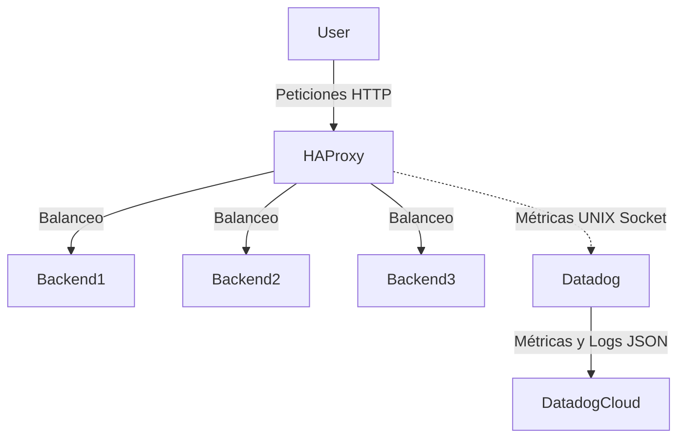

# Proyecto 8 - HAProxy + Datadog
--------------------------------------------------------------------

## Arquitectura del Clúster
El siguiente diagrama muestra cómo interactúan los componentes dentro de la máquina virtual (Vagrant):



--------------------------------------------------------------------
## Configuración de Datadog (API Key) (esto lo haces despues de hacer git clone y entrar a la maquina virtual)

1. Ingresar a [Datadog](https://app.datadoghq.com/).
2. En la barra de busqueda ingresar "API KEYS"
3. En la raíz de este proyecto, abrir el archivo .env
4. Pegar para que quede asi: `DD_API_KEY=tu_clave_aqui`

--------------------------------------------------------------------
# Ejecución

Para iniciar el entorno, Vagrant descargará y preparará una máquina Linux con Docker instalado.

```bash
git clone https://github.com/Katar012/proyecto8-haproxy-datadog/
cd proyecto8-haproxy-datadog
vagrant up
vagrant ssh lab
cd /vagrant
docker-compose up --build -d
```

## Primera Parte: Cluster HAProxy con backends

1. El estado de los backends se puede verificar desde el host en la [pagina de estadisticas de haproxy](http://192.168.65.10:8080) o la ip de la maquina http://192.168.65.10:8080.
Tambien podemos verificar de manera extra en http://192.168.65.10:8081/metrics la respuesta de los backends.

2. Luego verificamos en otra ventana de la misma maquina virtual "lab"
```bash
for i in {1..10}; do curl -s localhost:8081; done
```
Este ciclo verificara que tenemos un balance entre los 3 backends.

3. Con ```docker-compose logs haproxy``` podemos visualizar registros estructurados con la siguiente estructura como ejemplo:
```{"backend":"web_back","server":"backend1","status":200}```

## Segunda Parte: Integración Datadog y Regiones

⚠️ **¡MUY IMPORTANTE - CUIDADO CON LA REGIÓN DE DATADOG!** ⚠️
Datadog tiene múltiples regiones (ej: US1, US3, US5, EU). Es **vital** que la variable `DD_SITE` en el archivo `docker-compose.yml` coincida exactamente con la región de la cuenta donde se sacó la API KEY.
- Si sacaste la API KEY en la región por defecto (US1), el site debe ser `datadoghq.com`.
- Si usas un enlace de un compañero que está en US5 (`us5.datadoghq.com`), pero tu API Key es de US1, **los datos no van a aparecer en su dashboard**, se irán a tu cuenta en US1.
¡Asegúrate de estar viendo el dashboard en la misma cuenta y región donde inyectaste la API Key!

## Tercera Parte: Generación de tráfico con Artillery

Hemos creado diferentes escenarios de prueba en la carpeta `artillery/` para estresar el clúster y validar nuestras métricas:

- `normal.yml`: Tráfico estándar.
- `spike.yml`: Pico de tráfico repentino.
- `errors.yml`: Dispara 100% de errores HTTP 500 (apunta al endpoint roto `/error`).
- `latency.yml`: Dispara peticiones al endpoint `/slow` para simular lentitud y ver cómo se eleva la gráfica de latencia promedio.
- `soak.yml`: Prueba de larga duración (5 minutos) para validar estabilidad y consumo de RAM.
- `mixed.yml`: 90% tráfico sano y 10% tráfico con errores (ideal para ver cómo se separan las gráficas de peticiones vs errores).

**¿Cómo ejecutarlas?**
```bash
docker-compose run --rm artillery run latency.yml
```
*(Cambia `latency.yml` por el nombre de la prueba que quieras ejecutar. Recuerda esperar un par de minutos para que Datadog refleje los datos).*

## Cuarta Parte: Dashboards y Monitores (Paso a Paso)

### 1. Creación de Dashboards (Uso de JSON)
Para evitar configurar los gráficos a mano, Datadog permite importar widgets usando código JSON.
1. En Datadog, ve a **Dashboards -> New Dashboard**.
2. Haz clic en **Add Widget** y busca la opción **JSON** o haz clic en un widget vacío y ve a la pestaña JSON.
3. Para monitorear el número exacto de Backends Vivos, pega este JSON (que cuenta los contenedores Docker en ejecución):
   ```json
   {
       "title": "Backends Activos",
       "type": "query_value",
       "requests": [
           {
               "response_format": "scalar",
               "queries": [
                   {
                       "data_source": "metrics",
                       "name": "query1",
                       "query": "count_not_null(avg:docker.cpu.usage{image_name IN (vagrant_backend1, vagrant_backend2, vagrant_backend3)} by {image_name})"
                   }
               ],
               "formulas": [ { "formula": "query1" } ],
               "aggregator": "last"
           }
       ],
       "autoscale": true,
       "precision": 0
   }
   ```
4. Haz lo mismo con el widget de tipo **Top List** pegando el código respectivo para ver el estado individual de consumo de cada contenedor.

### 2. Creación de Alertas/Monitores
Hemos configurado dos monitores críticos. Para que a tus compañeros se les haga más fácil crearlos, pueden importar la configuración exportada en formato JSON, o crearlos manualmente:

**Opción A (Importar JSON):**
Datadog permite exportar e importar monitores a través de la API o herramientas de IaC, pero en la interfaz web también puedes clonar monitores si les pasas el JSON. Esa es la razón de ser de los bloques JSON que Datadog genera: facilitarle a los equipos copiar alertas entre cuentas.

**Opción B (Manual paso a paso):**

**Alerta 1: Tasa de Errores > 5%**
1. Ve a **Monitors -> New Monitor -> Metric**.
2. Elige la pestaña **Formula**.
3. Letra `a`: `haproxy.backend.response.5xx{*}`
4. Letra `b`: `haproxy.frontend.requests.rate{*}`
5. Fórmula: `(a / b) * 100`
6. En Set Alert Conditions pon **Above 5** y dale a Guardar.

**Alerta 2: Backend Caído**
1. Ve a **Monitors -> New Monitor -> Metric**.
2. En métrica escribe `docker.cpu.usage`, from `image_name:vagrant_backend*`, avg by `image_name`.
3. Datadog lo detectará como una "Multi Alert".
4. Baja hasta encontrar la opción **"Notify if data is missing"** y pon que avise si no hay datos por más de 1 minuto.
5. Usa `{{image_name.name}}` en el título para saber exactamente cuál de los 3 se apagó.
--------------------------------------------------------------------
# Integrantes

### Juan David Cuero Reina.
### Juan Esteban Vila Martin.
### Alejandro Rodriguez.
### Diego Alejandro Ramirez.
