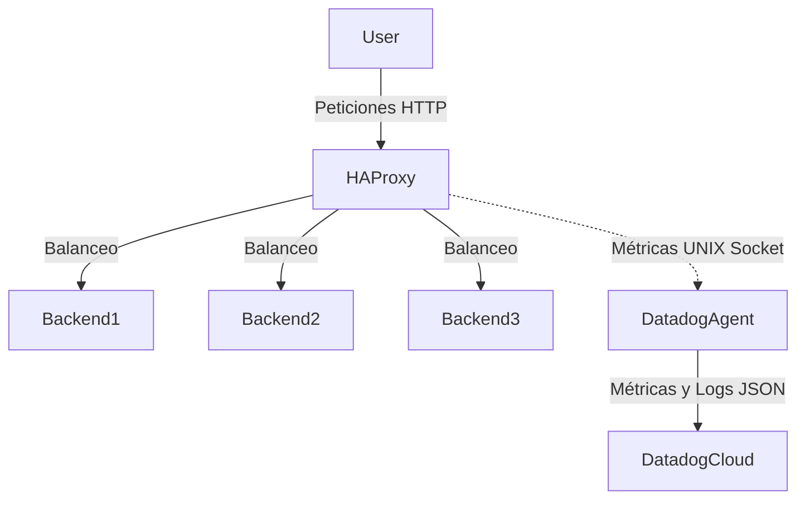

# Proyecto 8 - HAProxy + Datadog
--------------------------------------------------------------------

## Arquitectura del Clúster
El siguiente diagrama muestra cómo interactúan los componentes dentro de la máquina virtual (Vagrant):



--------------------------------------------------------------------
## Configuración de Datadog (API Key)

Para enviar nuestras métricas, usamos el Agente de Datadog. Por seguridad, la llave del API **no se debe escribir directamente en el código** (hardcodear). Sigue estos pasos:

1. Ingresa a tu cuenta en [Datadog](https://app.datadoghq.com/).
2. Ve a **Organization Settings** -> **API Keys** y obtén tu clave.
3. En la raíz de este proyecto, copia o renombra el archivo `.env.example` a un nuevo archivo llamado `.env`.
4. Abre el archivo `.env` y pega tu clave para que quede así: `DD_API_KEY=tu_clave_aqui`

*(Nota: El archivo `.env` ya está configurado en el `.gitignore` para jamás subirse al repositorio, manteniendo tu clave segura).*

--------------------------------------------------------------------
# Ejecución

Para iniciar el entorno, Vagrant descargará y preparará una máquina Linux con Docker instalado.

```bash
git clone https://github.com/Katar012/proyecto8-haproxy-datadog/
cd proyecto8-haproxy-datadog
vagrant up
vagrant ssh lab
cd /vagrant
docker-compose up --build -d
```
### Luego verificamos en otra ventana de la misma maquina virtual "lab"
```bash
for i in {1..10}; do curl -s localhost:8081; done
```
--------------------------------------------------------------------
# Integrantes

### Juan David Cuero Reina.
### Juan Esteban Vila Marin.
### Alejandro Rodriguez.
### Diego Alejandro Ramirez.
